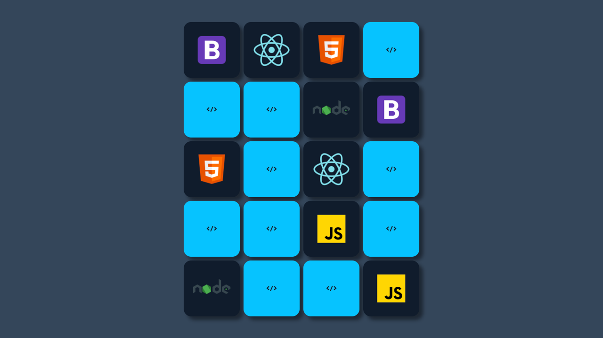

  

# ⚔ Jogo da Velha 🛡
Projeto do curso ProgramadorBR em que aprendi a desenvolver a lógica por trás do jogo da velha. Projeto simples mas bem legal de fazer, pretendo fazer uma versão melhorada e atualizada no futuro com React.

## ⚙️ Funcionalidades

- [x] Estilizações global, comun e individuais;
- [x] Importação de fontes Google;
- [x] Paginação de posts;
- [x] Cálculo de tempo estimado de leitura do post;
- [x] Geração de páginas estáticas com os métodos `getStaticProps` e `getStaticPaths`;
- [x] Formatação de datas com `date-fns`;
- [x] Uso de ícones com `react-icons`;
- [x] Requisições HTTP com `fetch`;

## 🚀 Tecnologias

- [HTML](https://www.w3schools.com/html/)
- [CSS](https://developer.mozilla.org/pt-BR/docs/Web/CSS)
- [JavaScript](https://developer.mozilla.org/pt-BR/docs/Web/JavaScript)

## 📝 Considerações
Em breve irei refazer esse projeto com melhorias e com as funcionalidades completas.
